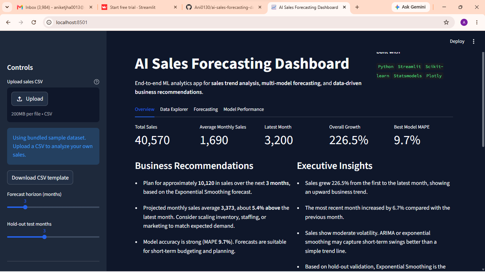

# AI Sales Forecasting Dashboard

An interactive machine learning dashboard that forecasts monthly sales, compares forecasting models, and turns predictions into actionable business recommendations.

**Live demo:** https://ai-sales-forecasting-dashboard-e6wevpy2wpq34degkbjuzo.streamlit.app/



---

## Why this project

This project demonstrates end-to-end data science skills employers look for:

- **Data engineering:** CSV ingestion, validation, and preprocessing
- **Machine learning:** Multiple time-series models with hold-out validation
- **Analytics:** KPI tracking, trend analysis, and model comparison
- **Product thinking:** Interactive UI, exports, and business recommendations
- **MLOps basics:** Model persistence with joblib

---

## Features

| Feature | Description |
|--------|-------------|
| Multi-model forecasting | Linear Regression, ARIMA, Exponential Smoothing |
| Model validation | Hold-out testing with MAE, RMSE, and MAPE |
| Auto model selection | Picks the best-performing model on recent data |
| Interactive dashboard | Streamlit tabs for overview, data, forecasts, and performance |
| CSV upload | Analyze your own sales history |
| Export & persistence | Download forecasts and save trained models |

---

## Tech stack

- **Python** — core language
- **Streamlit** — web dashboard
- **Pandas & NumPy** — data processing
- **Scikit-learn** — linear regression baseline
- **Statsmodels** — ARIMA and exponential smoothing
- **Plotly** — interactive charts
- **Joblib** — model serialization

---

## Project structure

```text
ai-sales-forecasting-dashboard/
├── app.py                  # Streamlit dashboard entry point
├── requirements.txt        # Python dependencies
├── data/
│   ├── sales_data.csv      # Sample dataset (24 months)
│   └── upload_template.csv # CSV format example
├── src/
│   ├── data_loader.py      # Load and validate data
│   ├── forecasting.py        # Forecasting models and evaluation
│   ├── visualization.py    # Plotly chart builders
│   └── utils.py            # KPIs, insights, recommendations
├── models/                 # Saved model artifacts (generated at runtime)
└── .streamlit/config.toml  # App theme and settings
```

---

## Run locally

### 1. Clone the repository

```bash
git clone https://github.com/Ani0130/ai-sales-forecasting-dashboard.git
cd ai-sales-forecasting-dashboard
```

### 2. Install dependencies

```bash
pip install -r requirements.txt
```

### 3. Start the dashboard

```bash
streamlit run app.py
```

Open `http://localhost:8501` in your browser.

---

## Upload your own data

CSV must include these columns:

| Column | Type | Example |
|--------|------|---------|
| `Date` | Monthly date | `2024-01-01` |
| `Sales` | Numeric sales value | `1200` |

Use at least **6 months** of data (12+ recommended for seasonal models). See `data/upload_template.csv` for the expected format.

---

## How models are evaluated

1. The most recent N months are held out as a test set (default: 3).
2. Each model trains on earlier data and predicts the hold-out period.
3. Models are ranked by **MAPE** (Mean Absolute Percentage Error).
4. The lowest-MAPE model is used for the forward forecast (unless overridden manually).

This avoids misleading in-sample accuracy and reflects real forecasting performance more honestly.

---

## Deploy to Streamlit Community Cloud

1. Push this repo to GitHub.
2. Go to [share.streamlit.io](https://share.streamlit.io).
3. Connect your GitHub account and select this repository.
4. Set **Main file path** to `app.py`.
5. Click **Deploy**.

After deployment, paste your live URL at the top of this README and add a screenshot to `assets/dashboard-preview.png`.

---

## Resume bullet examples

- Built an ML-powered sales forecasting dashboard with Streamlit, comparing 3 time-series models using hold-out MAPE validation.
- Implemented data validation, automated model selection, and exportable forecasts for business planning workflows.
- Deployed an interactive analytics app to Streamlit Cloud with Plotly visualizations and persisted model artifacts.

---

## Future improvements

- Forecast confidence intervals
- Product/region-level forecasting
- Database and API integrations
- Scheduled model retraining

---

## Author

**Aniket Jha**  
GitHub: [@Ani0130](https://github.com/Ani0130)  
LinkedIn: [Aniket Jha](https://www.linkedin.com/in/aniket-jha-1051b4252/)

---

## License

MIT
